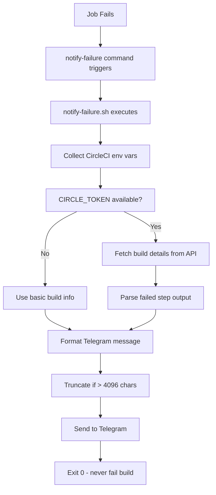

# Architecture - CircleCI Failure Notifier Orb

## Overview

This orb provides a single command `notify-failure` that integrates with CircleCI's failure handling to send rich Telegram notifications when builds fail.

## Core Components

### 1. Orb Structure

```
src/
├── @orb.yml              # Orb metadata
├── commands/
│   └── notify-failure.yml # Command definition
└── scripts/
    └── notify-failure.sh  # Implementation logic
```

### 2. Command Flow



### 3. Data Collection

#### Built-in Environment Variables
The orb leverages CircleCI's built-in environment variables:

- `CIRCLE_PROJECT_REPONAME` - Repository name
- `CIRCLE_BRANCH` - Git branch
- `CIRCLE_JOB` - Job name
- `CIRCLE_BUILD_NUM` - Build number
- `CIRCLE_BUILD_URL` - Direct build link
- `CIRCLE_WORKFLOW_ID` - Workflow identifier
- `CIRCLE_SHA1` - Full commit SHA
- `CIRCLE_PROJECT_USERNAME` - GitHub org/user

#### API-Enhanced Data
When `CIRCLE_TOKEN` is available:

1. **Build Details API Call**:
   ```
   GET https://circleci.com/api/v1.1/project/github/{org}/{repo}/{build_num}
   ```

2. **Step Output Extraction**:
   - Parse JSON response for failed steps
   - Extract `output_url` from failed steps
   - Fetch actual error content from output URLs

3. **Error Processing**:
   - Take last N lines (configurable via `max_lines`)
   - HTML-escape special characters
   - Truncate to fit Telegram limits

### 4. Message Formatting

#### HTML Template
```html
🔴 <b>CI Failure</b>

📁 <b>Repository:</b> {repo_name}
🌿 <b>Branch:</b> {branch}
⚙️ <b>Job:</b> {job_name}
📝 <b>Commit:</b> {short_sha}

❌ <b>Error Output:</b>
<pre>{error_details}</pre>

🔗 <a href="{build_url}">View Build</a> | <a href="{workflow_url}">View Workflow</a>
```

#### Character Limits
- Telegram max message: 4096 characters
- Target limit: 4000 characters (safety buffer)
- Auto-truncation with "..." suffix

### 5. Error Handling Strategy

#### Graceful Degradation
```bash
set +e  # Never fail on errors

# API Token missing
if [ -z "$CIRCLE_TOKEN" ]; then
    # Skip API calls, use basic info
fi

# API calls fail
if ! curl_response=$(curl -s ...); then
    # Use fallback basic notification
fi

# Telegram API fails
if ! telegram_response=$(curl -s ...); then
    # Log error, exit 0 (don't fail build)
fi
```

#### Failure Modes
1. **No TELEGRAM_BOT_TOKEN**: Log error, exit 0
2. **No chat_id**: Log error, exit 0  
3. **No CIRCLE_TOKEN**: Send basic notification without error details
4. **CircleCI API failure**: Send basic notification
5. **Telegram API failure**: Log error, exit 0
6. **Network issues**: Timeout and exit 0

### 6. Security Considerations

#### Token Handling
- Tokens passed via environment variables (never in code)
- No token logging or echoing
- Tokens scoped to minimum required permissions

#### Data Privacy  
- Only sends build metadata and error output
- No source code or secrets in notifications
- Error output limited to last N lines

#### Network Security
- HTTPS for all API calls
- No credential exposure in URLs
- Proper error response handling

### 7. Performance Characteristics

#### Execution Time
- Basic notification: ~1-2 seconds
- With error fetching: ~3-5 seconds  
- Network dependent (API calls)

#### Resource Usage
- Minimal CPU (bash scripting)
- Low memory footprint
- Network bandwidth for API calls

#### API Rate Limits
- CircleCI API: 5000 requests/hour
- Telegram API: 30 messages/second
- Conservative usage pattern (failure-triggered only)

### 8. Integration Points

#### CircleCI Integration
```yaml
# Step-level (recommended)
steps:
  - run: make build
  - notify-failure:
      chat_id: "123456789"

# Post-step level
jobs:
  build:
    post-steps:
      - notify-failure:
          chat_id: "123456789"
```

#### Context Requirements
```yaml
# CircleCI Context: ci-notify
environment:
  TELEGRAM_BOT_TOKEN: "bot123456789:ABC..."
  CIRCLE_TOKEN: "ccipat_..."
```

### 9. Testing Strategy

#### Unit Testing
- Bash script functions individually testable
- Mock API responses for testing
- Test error conditions and edge cases

#### Integration Testing  
- Real CircleCI builds (dev orb versions)
- Telegram bot testing with test chats
- Multiple executor types (Docker, macOS, machine)

#### Load Testing
- Multiple concurrent notifications
- Large error output handling
- API rate limit behavior

### 10. Monitoring & Observability

#### Logging
- All operations logged with `[ci-failure-notifier]` prefix
- Success/failure status clearly indicated
- API response details in error cases

#### Metrics
- Success/failure rates
- API response times
- Message delivery confirmation

#### Debugging
```bash
# Enable debug logging
export NOTIFY_DEBUG=true

# Test notification manually  
export TELEGRAM_BOT_TOKEN="..."
export NOTIFY_CHAT_ID="..."
./src/scripts/notify-failure.sh
```

## Extension Points

### Future Enhancements
1. **Multi-platform support**: Slack, Discord, email
2. **Custom templates**: User-defined message formats
3. **Filtering**: Skip notifications for certain types of failures
4. **Retry logic**: Exponential backoff for API failures
5. **Metrics collection**: Success rates, timing data

### Customization Options
- Message templates via parameters
- Custom error parsing logic
- Additional metadata inclusion
- Multi-recipient notifications