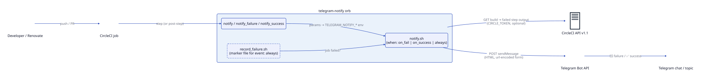

# telegram-notify

[](https://dl.circleci.com/status-badge/redirect/gh/kevnm67/telegram-notify/tree/main)
[](https://qlty.sh/gh/kevnm67/projects/telegram-notify)
[](https://qlty.sh/gh/kevnm67/projects/telegram-notify)
[](https://circleci.com/developer/orbs/orb/kevnm67/telegram-notify)
[](LICENSE)

A CircleCI orb that posts rich **Telegram** messages from your jobs — on
failure (with the failed step's output pulled from the CircleCI API), on
success, or always. Pure bash + curl, runs on any Linux/macOS executor, and
never fails your build.

## Table of Contents

- [Features](#features)
- [Quick Start](#quick-start)
- [Commands](#commands) — [`notify`](#notify) · [`notify_failure`](#notify_failure) · [`notify_success`](#notify_success)
- [Parameters](#parameters)
- [Message Format](#message-format)
- [Recipes](#recipes)
- [Architecture](#architecture)
- [Development](#development)
- [Releasing](#releasing)
- [Troubleshooting](#troubleshooting)
- [Security](#security)
- [Contributing](#contributing)
- [License](#license)

## Features

| | |
| --- | --- |
| 🔴 **Failure alerts** | `when: on_fail` step with the last *N* lines of the failed step's output |
| ✅ **Success alerts** | `when: on_success` step, optional `silent` delivery |
| 🔁 **Always** | one `post-steps` entry reports the real outcome of every job |
| 🧵 **Topics & mentions** | post into a forum topic, append `@mentions`, add a custom HTML line |
| 🛡️ **Failure-safe** | exits 0 on delivery errors unless `fail_on_error: true` |
| 🔒 **Escaped output** | repo/branch/job/commit and log output are HTML-escaped |
| 🧪 **Tested** | 40 bats unit tests + 4 CircleCI integration jobs against a Telegram API double |
| 🪶 **Zero deps** | bash + curl (uses `jq`/`python3` when present, falls back otherwise) |

## Quick Start

### 1. Create a Telegram bot

1. Message [@BotFather](https://t.me/botfather) → `/newbot` → copy the token
   (`123456789:ABCdef...`).
2. Add the bot to your group/channel (or message it directly).
3. Find the chat ID: send a message, then open
   `https://api.telegram.org/bot<TOKEN>/getUpdates` and read `chat.id`
   (group/channel IDs are negative, e.g. `-1001234567890`).

### 2. Create a CircleCI context

Create a context (e.g. `telegram`) with:

| Variable | Required | Purpose |
| ---------- | ---------- | --------- |
| `TELEGRAM_BOT_TOKEN` | yes | Bot token from BotFather |
| `TELEGRAM_CHAT_ID` | no | Default chat ID (so `chat_id` can be omitted in config) |
| `CIRCLE_TOKEN` | no | CircleCI API token; enables the error-output block on failures |

### 3. Use the orb

```yaml
version: 2.1

orbs:
  telegram-notify: kevnm67/telegram-notify@1.0.0

jobs:
  build:
    docker:
      - image: cimg/base:current
    steps:
      - checkout
      - run: make build
      - telegram-notify/notify_failure:
          chat_id: "-1001234567890"

workflows:
  build:
    jobs:
      - build:
          context: telegram
```

Preview the rendered message without sending anything by adding
`dry_run: true`.

## Commands

### `notify`

The general command. `event` selects when it fires:

| `event` | Runs | Reports |
| --------- | ------ | --------- |
| `failure` (default) | `when: on_fail` | 🔴 with error output |
| `success` | `when: on_success` | ✅ |
| `always` | `when: always` | the job's real outcome (a tiny `on_fail` marker step runs first) |

```yaml
- telegram-notify/notify:
    event: always
    chat_id: "-1001234567890"
    custom_message: "<i>nightly suite</i>"
```

### `notify_failure`

Shorthand for `notify` with `event: failure`. Accepts every parameter below
except `event`.

### `notify_success`

Shorthand for `notify` with `event: success`. Accepts every parameter below
except `event`.

## Parameters

| Parameter | Type | Default | Description |
| ----------- | ------ | --------- | ------------- |
| `event` | enum `failure` / `success` / `always` | `failure` | When to send (`notify` only) |
| `chat_id` | string | `""` | Telegram chat ID; falls back to `$TELEGRAM_CHAT_ID` |
| `bot_token` | env_var_name | `TELEGRAM_BOT_TOKEN` | Env var holding the bot token |
| `circle_token` | env_var_name | `CIRCLE_TOKEN` | Env var holding a CircleCI API token (optional) |
| `max_lines` | integer | `50` | Trailing lines of failed-step output to include |
| `include_links` | boolean | `true` | Append *View Build \| View Workflow* links |
| `custom_message` | string | `""` | Extra line under the headline (Telegram HTML allowed, sent verbatim) |
| `mentions` | string | `""` | Appended verbatim, e.g. `"@alice @bob"` |
| `thread_id` | string | `""` | Forum topic (`message_thread_id`) |
| `silent` | boolean | `false` | `disable_notification` |
| `dry_run` | boolean | `false` | Print the message instead of sending |
| `fail_on_error` | boolean | `false` | Fail the step if delivery fails |
| `vcs_type` | enum `github` / `bitbucket` | `github` | VCS segment of the CircleCI v1.1 API path |
| `api_base` | string | `https://api.telegram.org` | Bot API base URL (proxy / test double) |
| `step_name` | string | `Telegram notification` | Step name shown in the CircleCI UI |

All parameter names are `snake_case` (enforced by `orb-tools/review`).

## Message Format

```text
🔴 CI Failure
<custom_message>

📁 Repository: telegram-notify
🌿 Branch: feat/retry-logic
⚙️ Job: build
📝 Commit: a1b2c3d4
👤 Triggered by: kevin

❌ Error Output:
make: *** [build] Error 1
npm ERR! Build failed with exit code 1

🔗 View Build | View Workflow

@alice @bob
```

- The error block is capped at 3 000 characters and the whole message at
  Telegram's 4 096-character limit, so `<pre>` tags are never left open.
- ANSI colour codes are stripped from log output.
- Branch falls back to `CIRCLE_TAG` for tag builds.

## Recipes

More in [`src/examples/`](src/examples/).

<details>
<summary>Report every job in a workflow with one post-step</summary>

```yaml
workflows:
  ci:
    jobs:
      - test:
          context: telegram
          post-steps:
            - telegram-notify/notify:
                event: always
```

</details>

<details>
<summary>Success + failure with different audiences</summary>

```yaml
- telegram-notify/notify_success:
    chat_id: "-1001234567890"
    silent: true
- telegram-notify/notify_failure:
    chat_id: "-1001234567890"
    mentions: "@oncall"
    max_lines: 30
```

</details>

<details>
<summary>Post into a forum topic</summary>

```yaml
- telegram-notify/notify_failure:
    chat_id: "-1001234567890"
    thread_id: "42"
```

</details>

<details>
<summary>Keep secrets out of config</summary>

Set `TELEGRAM_CHAT_ID` in the context and omit `chat_id` entirely. Use a
differently named token variable with `bot_token: MY_BOT_TOKEN`.

</details>

## Architecture



```text
src/
├── @orb.yml                  # orb metadata
├── commands/
│   ├── notify.yml            # event-driven command (failure | success | always)
│   ├── notify_failure.yml    # thin wrapper → notify(event: failure)
│   └── notify_success.yml    # thin wrapper → notify(event: success)
├── scripts/
│   ├── notify.sh             # all logic; sourced by the tests
│   └── record_failure.sh     # on_fail marker for event: always
└── examples/                 # usage examples shown in the orb registry
```

`notify.sh` receives its inputs as `TELEGRAM_NOTIFY_*` environment variables
(mapped from orb parameters) and CircleCI's `CIRCLE_*` built-ins, fetches
the failed step's output from the v1.1 API when a token is present, builds an
HTML message and POSTs it as a URL-encoded form to `sendMessage`. See the
[wiki Architecture page](https://github.com/kevnm67/telegram-notify/wiki/Architecture)
for the full walkthrough.

## Development

```bash
make setup        # brew deps + pre-commit hooks
make lint         # shellcheck, yamllint, markdownlint, orb pack + validate
make test         # bats unit suite (tests/notify.bats)
make coverage     # kcov line coverage (Docker on macOS)
make validate     # circleci orb pack + validate
make diagrams     # render docs/architecture/*.d2
make publish-dev TAG=alpha   # publish kevnm67/telegram-notify@dev:alpha
```

CI (`.circleci/config.yml`) follows the CircleCI Orb Development Kit:
`orb-tools/lint` → `orb-tools/pack` → `orb-tools/review` →
`shellcheck/check` → `unit_tests` (bats + kcov → qlty coverage) →
`orb-tools/continue` → `.circleci/test-deploy.yml` (integration jobs against
a local Telegram API double) → publish.

## Releasing

- Every merge to `main` publishes `kevnm67/telegram-notify@dev:alpha`.
- Tag `vX.Y.Z` on `main` to publish a production version:

```bash
git tag v1.0.0 && git push origin v1.0.0
```

Pin consumers to a major (`@1`) or exact version; never `@volatile`.

## Troubleshooting

| Symptom | Check |
| --------- | ------- |
| No message at all | Context attached to the job? `TELEGRAM_BOT_TOKEN` set? Step log shows `[telegram-notify] ERROR: ...` |
| `Bad Request: chat not found` | Bot isn't in the chat, or `chat_id` is wrong (group IDs are negative) |
| No error-output block | `CIRCLE_TOKEN` missing/insufficient, or the job was cancelled rather than failed |
| Message truncated | Lower `max_lines`; the orb caps the block at 3 000 chars |
| `can't parse entities` | `custom_message` contains unbalanced HTML — it is sent verbatim |

Run with `dry_run: true` to print the exact message the orb would send.

## Security

See [`.github/SECURITY.md`](.github/SECURITY.md). Tokens are read from
environment variables and never logged; interpolated job data is
HTML-escaped.

## Contributing

1. Branch from `main` (`feat/…`, `fix/…`, `chore/…`).
2. `make lint test` must pass; keep coverage ≥ 85 % on changed lines.
3. Add/adjust bats tests and README/wiki docs for any parameter change.
4. Open a PR — CI, Claude review and qlty run automatically; PRs squash-merge.

## License

MIT — see [LICENSE](LICENSE).
