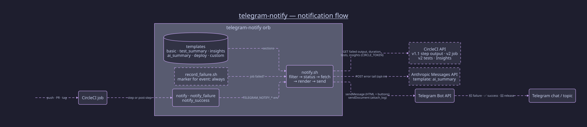

# telegram-notify

[](https://dl.circleci.com/status-badge/redirect/gh/kevnm67/telegram-notify/tree/main)
[](https://qlty.sh/gh/kevnm67/projects/telegram-notify)
[](https://qlty.sh/gh/kevnm67/projects/telegram-notify)
[](https://circleci.com/developer/orbs/orb/kevnm67/telegram-notify)
[](LICENSE)

A CircleCI orb that posts rich **Telegram** messages from your jobs — on
failure (with the failed step's output pulled from the CircleCI API), on
success, or always — with built-in templates for **test summaries**, **CI
insights**, **AI failure analysis** and **releases**. Pure bash + curl, runs on
any Linux/macOS executor (bash 3.2+), and never fails your build.

## Table of Contents

- [Features](#features)
- [Quick Start](#quick-start)
- [Commands](#commands) — [`notify`](#notify) · [`notify_failure`](#notify_failure) · [`notify_success`](#notify_success)
- [Templates](#templates)
- [Parameters](#parameters)
- [Message Format](#message-format)
- [Recipes](#recipes)
- [Architecture](#architecture)
- [Development](#development)
- [Releasing](#releasing)
- [Troubleshooting](#troubleshooting)
- [Security](#security)
- [Contributing](#contributing)
- [License](#license)

## Features

| | |
| --- | --- |
| 🔴 **Failure alerts** | `when: on_fail` step with the last *N* lines of the failed step's output |
| ✅ **Success alerts** | `when: on_success` step, optional `silent` delivery |
| 🔁 **Always** | one `post-steps` entry reports the real outcome of every job |
| 🧵 **Topics & mentions** | post into a forum topic, append `@mentions`, add a custom HTML line |
| 🛡️ **Failure-safe** | exits 0 on delivery errors unless `fail_on_error: true` |
| 🔒 **Escaped output** | repo/branch/job/commit and log output are HTML-escaped |
| 🧪 **Tested** | 40 bats unit tests + 4 CircleCI integration jobs against a Telegram API double |
| 🪶 **Zero deps** | bash + curl (uses `jq`/`python3` when present, falls back otherwise) |

## Quick Start

### 1. Create a Telegram bot

1. Message [@BotFather](https://t.me/botfather) → `/newbot` → copy the token
   (`123456789:ABCdef...`).
2. Add the bot to your group/channel (or message it directly).
3. Find the chat ID: send a message, then open
   `https://api.telegram.org/bot<TOKEN>/getUpdates` and read `chat.id`
   (group/channel IDs are negative, e.g. `-1001234567890`).

### 2. Create a CircleCI context

Create a context (e.g. `telegram`) with:

| Variable | Required | Purpose |
| ---------- | ---------- | --------- |
| `TELEGRAM_BOT_TOKEN` | yes | Bot token from BotFather |
| `TELEGRAM_CHAT_ID` | no | Default chat ID (so `chat_id` can be omitted in config) |
| `CIRCLE_TOKEN` | no | CircleCI API token; enables error output, job duration, `test_summary` and `insights` |
| `ANTHROPIC_API_KEY` | no | Only for `template: ai_summary` |

### 3. Use the orb

```yaml
version: 2.1

orbs:
  telegram-notify: kevnm67/telegram-notify@0.0.1

jobs:
  build:
    docker:
      - image: cimg/base:current
    steps:
      - checkout
      - run: make build
      - telegram-notify/notify_failure:
          chat_id: "-1001234567890"

workflows:
  build:
    jobs:
      - build:
          context: telegram
```

Preview the rendered message without sending anything by adding
`dry_run: true`.

## Commands

### `notify`

The general command. `event` selects when it fires:

| `event` | Runs | Reports |
| --------- | ------ | --------- |
| `failure` (default) | `when: on_fail` | 🔴 with error output |
| `success` | `when: on_success` | ✅ |
| `always` | `when: always` | the job's real outcome (a tiny `on_fail` marker step runs first) |

```yaml
- telegram-notify/notify:
    event: always
    chat_id: "-1001234567890"
    custom_message: "<i>nightly suite</i>"
```

### `notify_failure`

Shorthand for `notify` with `event: failure`. Accepts every parameter below
except `event`.

### `notify_success`

Shorthand for `notify` with `event: success`. Accepts every parameter below
except `event`.

## Templates

Pick a layout with `template:`. Every template keeps the headline, the linked
metadata block and (on failure) the error output; the template adds a section.

| Template | Adds | Needs |
| --- | --- | --- |
| `basic` (default) | — | — |
| `test_summary` | `🧪 12 passed · 1 failed · 2 skipped · 15 total · ⏱ 4.2s` plus the first `max_failed_tests` failures with their first message line | `store_test_results` before the step + `CIRCLE_TOKEN` |
| `insights` | `📈` workflow success rate, p95 duration, MTTR, throughput and flaky-test count for `insights_window` | `CIRCLE_TOKEN` (workflow name is resolved from the API, or set `workflow_name`) |
| `ai_summary` | `🤖` two-sentence root cause, `🛠` likely fix, `📋` a copy-paste prompt for your AI coding assistant (inside `<pre>`) | `ANTHROPIC_API_KEY`; failure events only; `ai_model` defaults to `claude-opus-5` — one short request per failure |
| `deploy` | `🚀 Deployed v1.2.3 → production` release card (tag linked) | tag build or `deploy_environment` |
| `custom` | your `custom_body` with `{{ENV_VAR}}` placeholders (values HTML-escaped) — replaces the whole body | — |

```yaml
- store_test_results:
    path: test-results
- telegram-notify/notify:
    event: always
    template: test_summary
```

```yaml
- telegram-notify/notify_failure:
    template: ai_summary
    attach_log: true
    mentions: "@oncall"
```

## Parameters

| Parameter | Type | Default | Description |
| --- | --- | --- | --- |
| `event` | enum `failure` / `success` / `always` | `failure` | When to send (`notify` only) |
| `template` | enum | `basic` | `basic`, `test_summary`, `insights`, `ai_summary`, `deploy`, `custom` |
| `chat_id` | string | `""` | Telegram chat ID; falls back to `$TELEGRAM_CHAT_ID` |
| `bot_token` | env_var_name | `TELEGRAM_BOT_TOKEN` | Env var holding the bot token |
| `circle_token` | env_var_name | `CIRCLE_TOKEN` | Env var holding a CircleCI API token (optional) |
| `custom_body` | string | `""` | Body for `template: custom` (HTML + `{{ENV_VAR}}`) |
| `custom_message` | string | `""` | Extra line under the headline (Telegram HTML allowed, sent verbatim) |
| `mentions` | string | `""` | Appended verbatim, e.g. `"@alice @bob"` |
| `max_lines` | integer | `50` | Trailing lines of failed-step output to include |
| `attach_log` | boolean | `false` | Upload the failed step's full output as a `.log` document |
| `buttons` | boolean | `true` | Links as inline keyboard buttons (false → text links) |
| `include_links` | boolean | `true` | Include build / workflow / PR links at all |
| `include_duration` | boolean | `true` | Show `⏱ Duration` (needs `circle_token`) |
| `thread_id` | string | `""` | Forum topic (`message_thread_id`) |
| `silent` | boolean | `false` | `disable_notification` |
| `branch_pattern` | string | `""` | Comma-separated anchored regexes, e.g. `"main,release/.*"` |
| `tag_pattern` | string | `""` | Same for tag builds, e.g. `"v[0-9]+\.[0-9]+\.[0-9]+"` |
| `invert_match` | boolean | `false` | Notify only when the ref does **not** match |
| `anthropic_api_key` | env_var_name | `ANTHROPIC_API_KEY` | Env var holding the Anthropic key (`ai_summary`) |
| `ai_model` | string | `claude-opus-5` | Model for `ai_summary` |
| `ai_max_tokens` | integer | `700` | Output cap for `ai_summary` |
| `max_failed_tests` | integer | `5` | Failed tests listed by `test_summary` |
| `insights_window` | enum | `last-30-days` | `last-24-hours` … `last-90-days` |
| `workflow_name` | string | `""` | Workflow for `insights` (auto-resolved when empty) |
| `deploy_environment` | string | `""` | Label for `deploy` |
| `dry_run` | boolean | `false` | Print the message (and buttons) instead of sending |
| `fail_on_error` | boolean | `false` | Fail the step if delivery fails |
| `vcs_type` | enum `github` / `bitbucket` | `github` | API paths and commit/branch links |
| `api_base` | string | `https://api.telegram.org` | Bot API base URL (proxy / test double) |
| `step_name` | string | `Telegram notification` | Step name in the CircleCI UI |

All parameter names are `snake_case` (enforced by `orb-tools/review`). The
three command files are generated from `scripts/dev/generate-commands.py`.

All parameter names are `snake_case` (enforced by `orb-tools/review`).

## Message Format

```text
🔴 CI Failure
<custom_message>

📁 Repository: telegram-notify          ← linked
🌿 Branch: feat/retry-logic             ← linked (🏷 Tag: v1.2.3 on tag builds)
⚙️ Job: build                           ← linked
📝 Commit: a1b2c3d4 · PR #12            ← PR linked
👤 Triggered by: kevin
⏱ Duration: 2m 13s

🧪 Tests: ❌ 12 passed · 1 failed · 2 skipped · 15 total · ⏱ 4.2s   ← template section
  • suite.Login › rejects empty password — AssertionError: expected 401

❌ Error Output:
make: *** [build] Error 1

@alice @bob
[ 🔎 View build ]  [ 🧭 Workflow ]  [ 🔀 Pull request ]      ← inline buttons
```

- The error block is sized so the whole message stays under Telegram's
  4 096-character limit with `<pre>` tags never left open; `attach_log`
  carries the full output as a document.
- ANSI colour codes are stripped from log output.
- Branch falls back to `CIRCLE_TAG` for tag builds.
- `custom_message` and `mentions` are sent **verbatim** (Telegram HTML allowed). Only feed them
  trusted config — never untrusted pipeline values such as `<< pipeline.git.commit_message >>`
  on a repo that builds fork PRs, or a contributor can inject links/markup into your chat.

## Recipes

More in [`src/examples/`](src/examples/).

<details>
<summary>Report every job in a workflow with one post-step</summary>

```yaml
workflows:
  ci:
    jobs:
      - test:
          context: telegram
          post-steps:
            - telegram-notify/notify:
                event: always
```

</details>

<details>
<summary>Success + failure with different audiences</summary>

```yaml
- telegram-notify/notify_success:
    chat_id: "-1001234567890"
    silent: true
- telegram-notify/notify_failure:
    chat_id: "-1001234567890"
    mentions: "@oncall"
    max_lines: 30
```

</details>

<details>
<summary>Post into a forum topic</summary>

```yaml
- telegram-notify/notify_failure:
    chat_id: "-1001234567890"
    thread_id: "42"
```

</details>

<details>
<summary>Only alert on main / release branches, announce tagged releases</summary>

```yaml
- telegram-notify/notify_failure:
    branch_pattern: "main,release/.*"
- telegram-notify/notify_success:
    template: deploy
    deploy_environment: production
    tag_pattern: "v[0-9]+\\.[0-9]+\\.[0-9]+"
```

</details>

<details>
<summary>Weekly CI health report</summary>

```yaml
- telegram-notify/notify_success:
    template: insights
    workflow_name: ci
    insights_window: last-7-days
    custom_message: "<b>Weekly CI health</b>"
```

</details>

<details>
<summary>Keep secrets out of config</summary>

Set `TELEGRAM_CHAT_ID` in the context and omit `chat_id` entirely. Use a
differently named token variable with `bot_token: MY_BOT_TOKEN`.

</details>

## Architecture

<a href="docs/architecture/notification_flow-dark.svg" target="_blank">
  
</a>

*Click the diagram to open it full size. It is vector, so it stays sharp at any zoom.*

Source is [`docs/architecture/notification_flow.d2`](docs/architecture/notification_flow.d2) —
regenerate with `make diagrams`:

```bash
d2 validate docs/architecture/notification_flow.d2
d2 --bundle --theme 200 --layout elk --pad 60 \
   docs/architecture/notification_flow.d2 docs/architecture/notification_flow-dark.svg
```

```text
src/
├── @orb.yml                  # orb metadata
├── commands/                 # generated by scripts/dev/generate-commands.py
│   ├── notify.yml            # event-driven command (failure | success | always)
│   ├── notify_failure.yml    # thin wrapper → notify(event: failure)
│   └── notify_success.yml    # thin wrapper → notify(event: success)
├── scripts/
│   ├── notify.sh             # all logic: filters, fetch, templates, render, send
│   └── record_failure.sh     # on_fail marker for event: always
└── examples/                 # usage examples shown in the orb registry
```

`notify.sh` receives its inputs as `TELEGRAM_NOTIFY_*` environment variables
(mapped from orb parameters) and CircleCI's `CIRCLE_*` built-ins, applies the
branch/tag filters, fetches the failed step's output (v1.1), duration (v2),
test results (v2) or Insights metrics when a token is present, optionally asks
Claude for an analysis, builds an HTML message and POSTs it as a URL-encoded
form to `sendMessage` (with an inline keyboard), then `sendDocument` for
`attach_log`. See the
[wiki Architecture page](https://github.com/kevnm67/telegram-notify/wiki/Architecture)
for the full walkthrough.

## Development

```bash
make setup        # brew deps + pre-commit hooks
make lint         # shellcheck, yamllint, markdownlint, orb pack + validate
make test         # bats unit suite (tests/notify.bats)
make test-bash32  # same suite on bash 3.2 without jq/python3 (Docker)
make integration  # every template against mock Telegram + stubbed CircleCI/Anthropic APIs
make coverage     # kcov line coverage (Docker on macOS)
make validate     # circleci orb pack + validate
make diagrams     # render docs/architecture/*.d2
make publish-dev TAG=alpha   # publish kevnm67/telegram-notify@dev:alpha
```

CI (`.circleci/config.yml`) follows the CircleCI Orb Development Kit:
`orb-tools/lint` → `orb-tools/pack` → `orb-tools/review` →
`shellcheck/check` → `unit_tests` (bats + kcov → qlty coverage) +
`unit_tests_bash32` → `orb-tools/continue` → `.circleci/test-deploy.yml`
(six integration jobs against a local Telegram API double and stubbed
CircleCI/Anthropic APIs) → publish. A manual `live_test` pipeline parameter
runs the published `@dev:alpha` orb against real Telegram — see
`.claude/skills/live-test`.

## Releasing

- Every merge to `main` publishes `kevnm67/telegram-notify@dev:alpha`.
- Tag `vX.Y.Z` on `main` to publish a production version:

```bash
git tag v1.0.0 && git push origin v1.0.0
```

Pin consumers to a major (`@1`) or exact version; never `@volatile`.

## Troubleshooting

| Symptom | Check |
| --------- | ------- |
| No message at all | Context attached to the job? `TELEGRAM_BOT_TOKEN` set? Step log shows `[telegram-notify] ERROR: ...` |
| `Bad Request: chat not found` | Bot isn't in the chat, or `chat_id` is wrong (group IDs are negative) |
| No error-output block | `CIRCLE_TOKEN` missing/insufficient, or the job was cancelled rather than failed |
| `test_summary` section missing | `store_test_results` must run **before** the notify step; the step log says why it was skipped |
| `insights` section missing | workflow name could not be resolved (set `workflow_name`) or Insights rate-limited the request |
| `ai_summary` section missing | `ANTHROPIC_API_KEY` unset, success event, or no error output to analyse — see the step log |
| Message truncated | Lower `max_lines`; the orb caps the block at 3 000 chars |
| `can't parse entities` | `custom_message` contains unbalanced HTML — it is sent verbatim |

Run with `dry_run: true` to print the exact message the orb would send.

## Security

See [`.github/SECURITY.md`](.github/SECURITY.md). Tokens are read from
environment variables and never logged; interpolated job data (including
test names, log lines and AI output) is HTML-escaped. `ai_summary` sends the
last `max_lines` of the failed step to Anthropic — don't enable it for jobs
whose logs may contain secrets.

## Contributing

1. Branch from `main` (`feat/…`, `fix/…`, `chore/…`).
2. `make lint test` must pass; keep coverage ≥ 85 % on changed lines.
3. Add/adjust bats tests and README/wiki docs for any parameter change.
4. Open a PR — CI, Claude review and qlty run automatically; PRs squash-merge.

## License

MIT — see [LICENSE](LICENSE).
